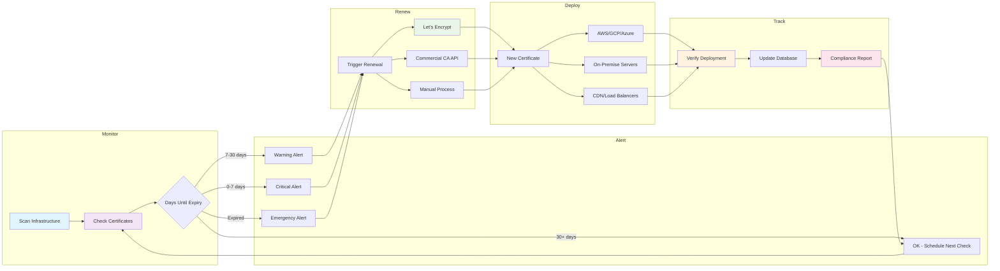

# Cert Monitor Pro

A Python tool for monitoring SSL certificate expiration and automating certificate management across infrastructure.

## What Is This?

SSL certificates expire. When they do, websites go down and incidents happen. This tool monitors certificate expiry dates and automates renewal workflows to prevent those problems.

I started with a bash script for basic certificate checking, but realized Python would provide better flexibility for features like web dashboards, automated renewals, and multi-cloud deployment support.

## Current Status

This is a command-line tool that checks SSL certificates and reports time remaining until expiration.

### What Works Now

- Check any SSL certificate expiration date
- Input cleaning (strips `https://`, trailing slashes, handles mixed case)
- Network error handling (DNS failures, timeouts, connection refused)
- SSL error detection (expired certificates, validation failures)
- Clear command-line interface with proper validation

### Usage

```bash
python cert_checker.py google.com 443
# Output: 67 days, 12:48:30.976882

python cert_checker.py expired.badssl.com 443  
# Output: Error: SSL error for 'expired.badssl.com': certificate has expired

python cert_checker.py https://GITHUB.COM/ 443
# Output: 89 days, 3:22:15.123456
```

The tool handles various input formats and provides clear error messages when things fail.

## Architecture Overview

The tool follows a complete certificate management lifecycle:



This diagram shows the five core phases: Monitor → Alert → Renew → Deploy → Track, with supporting systems for notifications and compliance.

## Development Approach

Each development phase is analyzed with SonarQube to maintain code quality and catch potential issues. This ensures the codebase stays maintainable as features are added and provides objective metrics for improvement.

The focus is on building secure, well-tested code that handles certificates and credentials properly. Security tooling is added progressively:
- Code quality analysis with SonarQube
- Dependency scanning with pip-audit or safety
- Web security testing (OWASP ZAP) when web components are added
- Regular security reviews of API integrations and authentication

## Development Roadmap

### Phase 1: Foundation (Complete)
- Basic certificate checking
- Error handling and input validation
- Command-line interface
- Code quality baseline

### Phase 2: Multi-Domain Support
- Check multiple certificates simultaneously
- YAML configuration file support
- Tabular output with status indicators
- Enhanced command-line options

### Phase 3: Automation
- Scheduled monitoring
- Let's Encrypt integration for automated renewal
- Email and webhook notifications
- Alert threshold configuration

### Phase 4: Deployment
- Upload to cloud providers (AWS, GCP, Azure)
- SFTP and webhook deployment options
- Certificate deployment automation
- Rollback capabilities

### Phase 5: Web Interface
- FastAPI-based dashboard
- REST API endpoints
- Certificate management interface
- Historical tracking and reporting

### Phase 6: Enterprise Features
- Commercial CA integrations (DigiCert, Sectigo)
- Team collaboration and permissions
- Advanced audit logging
- Custom workflow support

## The Big Picture

The goal is a comprehensive SSL certificate management platform handling the complete lifecycle:

1. **Monitor** certificates across infrastructure
2. **Alert** when certificates approach expiry
3. **Renew** certificates automatically where possible
4. **Deploy** renewed certificates to the right locations
5. **Track** certificate history and compliance

Many organizations struggle with certificate management across multiple domains, cloud providers, and teams. This tool centralizes that process while remaining flexible for different infrastructure setups.

Commercial CA automation is available for organizations using API-enabled certificate authorities. The open source version focuses on Let's Encrypt automation, with commercial CA support available as enterprise features or custom integrations.

## Technical Philosophy

- Start simple, add complexity gradually
- Code quality matters - regular analysis prevents technical debt
- Built for real infrastructure problems, not theoretical use cases
- Flexible architecture works with any hosting setup or cloud provider
- Security by design, not as an afterthought

## Requirements

- Python 3.12+
- No external dependencies (current version uses built-in libraries only)

## License

MIT License - See LICENSE file for details.
