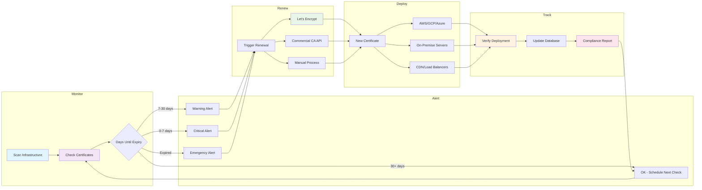

# Cert Monitor Pro

A Python tool for monitoring SSL certificate expiration and automating certificate management across infrastructure.

## What Is This?

SSL certificates expire. When they do, websites go down and incidents happen. This tool monitors certificate expiry dates and automates renewal workflows to prevent those problems.

I started with a bash script for basic certificate checking, but realized Python would provide better flexibility for features like web dashboards, automated renewals, and multi-cloud deployment support.

## Current Status

Command-line tool that checks SSL certificates across multiple domains and provides detailed status reports with professional tabular output.

### Features

- Multi-domain monitoring with YAML configuration files
- Certificate information extraction: expiration dates, issuer identification, days remaining
- Status determination: OK/WARNING/CRITICAL/EXPIRED/ERROR states
- Professional tabular output with grid formatting via `tabulate` library
- Modular architecture: separated business logic, presentation logic, and core functionality
- Robust error handling: distinguishes between expired certificates, SSL validation failures, network errors, and timeouts
- Input flexibility: command-line arguments, comma-separated lists, or YAML config files
- Smart formatting: only displays non-standard ports, truncates long error messages
- Input cleaning: strips `https://`, trailing slashes, handles mixed case

### Project Structure

```
cert-monitor-pro/
├── cert_checker.py              # Core certificate checking logic and CLI
├── status.py                    # Business logic for status determination
├── formatter.py                 # Presentation logic for table formatting
├── configuration_example.yaml   # Sample configuration
├── requirements.txt             # Python dependencies
└── README.md                    # This file
```

### Usage

**Configuration file (recommended for production):**
```bash
python cert_checker.py --config config.yaml
```

**Multiple domains via command-line:**
```bash
python cert_checker.py --domains google.com,github.com,example.com --port 443
```

**Custom timeout:**
```bash
python cert_checker.py --config config.yaml --timeout 30
```

**Sample output:**
```
+-----------------------+----------+------------+------------+------------------+--------------------------------+
| Domain                | Status   | Days Left  | Expires    | Issuer           | Error                          |
+=======================+==========+============+============+==================+================================+
| google.com            | OK       | 67         | 2025-01-18 | Google Trust ... | -                              |
+-----------------------+----------+------------+------------+------------------+--------------------------------+
| github.com            | OK       | 89         | 2025-02-09 | DigiCert Inc     | -                              |
+-----------------------+----------+------------+------------+------------------+--------------------------------+
| expired.badssl.com    | EXPIRED  | -          | -          | -                | certificate has expired        |
+-----------------------+----------+------------+------------+------------------+--------------------------------+
| wrong.host.badssl.com | ERROR    | -          | -          | -                | Hostname mismatch              |
+-----------------------+----------+------------+------------+------------------+--------------------------------+
```

### Configuration File Format

```yaml
domains:
  - hostname: google.com
    port: 443
  
  - hostname: example.com
    port: 8443
  
  - hostname: internal-service.local
    # port defaults to default_port

default_port: 443
```

## Architecture

### Current Modular Design

Three-layer architecture with clear separation of concerns:

- **cert_checker.py**: Core certificate retrieval, input handling, and orchestration
- **status.py**: Business logic for determining certificate health status  
- **formatter.py**: Presentation logic for table formatting and display

This separation allows independent evolution - status thresholds can change without touching formatting code, and new output formats (JSON, CSV) can be added without modifying certificate checking logic.

### Future Complete Lifecycle

The tool is being built toward a comprehensive certificate management platform:



Five core phases: Monitor → Alert → Renew → Deploy → Track

## Development Approach

Each development phase is analyzed with SonarQube to maintain code quality and catch potential issues. This ensures the codebase stays maintainable as features are added and provides objective metrics for improvement.

Security tooling is added progressively:
- Code quality analysis with SonarQube
- Dependency scanning with pip-audit or safety
- Web security testing (OWASP ZAP) when web components are added
- Regular security reviews of API integrations and authentication

## Development Roadmap

### Phase 1: Foundation ✅
- Basic certificate checking
- Error handling and input validation
- Command-line interface
- Code quality baseline

### Phase 2: Multi-Domain Support 

**Part 1 ✅**
- Multi-domain certificate checking
- YAML configuration file support
- Command-line interface enhancements
- Input validation and error handling

**Part 2 ✅**
- Issuer information extraction from certificates
- Status determination logic (OK/WARNING/CRITICAL)
- Tabular output formatting with grid layout
- Proper error categorization (EXPIRED vs ERROR)
- Code architecture improvements

**Part 3**
- JSON export format for programmatic access
- CSV export format for spreadsheet analysis
- Enhanced command-line options for export formats

### Phase 3: Automation (In Progress)
- Data persistence preparation
- Scheduled monitoring
- Let's Encrypt integration for automated renewal
- Email and webhook notifications
- Alert threshold configuration

### Phase 4: Deployment
- Upload to cloud providers (AWS, GCP, Azure)
- SFTP and webhook deployment options
- Certificate deployment automation
- Rollback capabilities

### Phase 5: Web Interface
- FastAPI-based dashboard
- REST API endpoints
- Certificate management interface
- Historical tracking and reporting

### Phase 6: Enterprise Features
- Commercial CA integrations (DigiCert, Sectigo)
- Team collaboration and permissions
- Advanced audit logging
- Custom workflow support

## The Big Picture

Comprehensive SSL certificate management platform handling the complete lifecycle:

1. **Monitor** certificates across infrastructure
2. **Alert** when certificates approach expiry
3. **Renew** certificates automatically where possible
4. **Deploy** renewed certificates to the right locations
5. **Track** certificate history and compliance

Many organizations struggle with certificate management across multiple domains, cloud providers, and teams. This tool centralizes that process while remaining flexible for different infrastructure setups.

Commercial CA automation is available for organizations using API-enabled certificate authorities. The open source version focuses on Let's Encrypt automation, with commercial CA support available as enterprise features or custom integrations.

## Technical Philosophy

- Start simple, add complexity gradually
- Code quality matters - regular analysis prevents technical debt
- Built for real infrastructure problems, not theoretical use cases
- Flexible architecture works with any hosting setup or cloud provider
- Security by design, not as an afterthought

## Requirements

- Python 3.12+
- tabulate 0.8.10+

Install dependencies:
```bash
pip install -r requirements.txt
```

## License

MIT License - See LICENSE file for details.

[](https://sonarcloud.io/summary/new_code?id=GiovaniDeJesus_cert-manager-pro)
