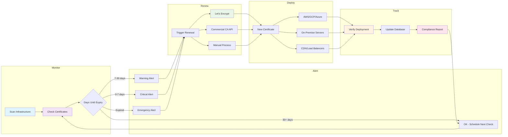

# Cert Monitor Pro

A Python tool for monitoring SSL certificate expiration and automating certificate management across infrastructure.

## What Is This?

SSL certificates expire. When they do, websites go down and incidents happen. This tool monitors certificate expiry dates and automates renewal workflows to prevent those problems.

I started with a bash script for basic certificate checking, but realized Python would provide better flexibility for features like web dashboards, automated renewals, and multi-cloud deployment support.

## Current Status

Intelligent certificate monitoring system with database integration, automated alerting, and change detection.

### Features

**Certificate Monitoring:**
- Multi-domain monitoring with YAML configuration files
- Certificate information extraction: expiration dates, issuer identification, days remaining
- Status determination: OK/WARNING/CRITICAL/EXPIRED/ERROR states
- Input flexibility: command-line arguments or YAML config files
- Input cleaning: strips `https://`, trailing slashes, handles mixed case
- Robust error handling: distinguishes between expired certificates, SSL validation failures, network errors, and timeouts

**Database & Intelligence:**
- SQLite database integration for state persistence
- Automatic change detection (renewals, status changes, issuer changes)
- Complete audit trail of all certificate events
- Alert deduplication (prevents notification spam)
- Renewal detection when expiration dates change

**Smart Alerting:**
- Email notifications via SMTP (tested with Mailtrap)
- Slack webhook support for team notifications
- Alerts only when status gets WORSE (OK → WARNING → CRITICAL)
- 24-hour deduplication window (no repeated alerts)
- Contextual alert messages based on severity level
- Tracks alert history in database

**Output & Reporting:**
- Professional tabular output with grid formatting via `tabulate` library
- Smart formatting: only displays non-standard ports, truncates long error messages
- Multiple export formats: table, JSON, CSV (planned)

**Architecture:**
- Modular design: separated business logic, presentation logic, and core functionality
- Atomic database transactions (all-or-nothing updates)
- Clean separation of concerns (monitoring, storage, alerting)
- Environment-based configuration for credentials

### Project Structure
```
cert-monitor-pro/
├── cert_checker.py              # Main orchestration and CLI
├── database.py                  # SQLite database layer
├── alerts.py                    # Email and webhook alerting
├── status.py                    # Business logic for status determination
├── formatter.py                 # Presentation logic for table formatting
├── configuration_example.yaml   # Sample configuration
├── requirements.txt             # Python dependencies
├── .env.example                 # Environment variables template
└── README.md                    # This file
```

### Usage

**Basic certificate checking with database:**
```bash
python cert_checker.py --config config.yaml
```

**Custom database location:**
```bash
python cert_checker.py --config config.yaml --db-path /path/to/certs.db
```

**Custom timeout:**
```bash
python cert_checker.py --config config.yaml --timeout 30
```

**Sample output:**
```
Loading domains from config file...
Checked 4 certificates
Database: certs.db

Current Status:
+-----------------------+----------+------------+------------+------------------+--------------------------------+
| Domain                | Status   | Days Left  | Expires    | Issuer           | Error                          |
+=======================+==========+============+============+==================+================================+
| google.com            | OK       | 67         | 2025-03-18 | Google Trust ... | -                              |
+-----------------------+----------+------------+------------+------------------+--------------------------------+
| github.com            | OK       | 89         | 2025-04-09 | DigiCert Inc     | -                              |
+-----------------------+----------+------------+------------+------------------+--------------------------------+
| example.com           | WARNING  | 25         | 2025-02-13 | Let's Encrypt    | -                              |
+-----------------------+----------+------------+------------+------------------+--------------------------------+
| expired.badssl.com    | EXPIRED  | -          | -          | -                | certificate has expired        |
+-----------------------+----------+------------+------------+------------------+--------------------------------+
```

If status changes trigger alerts:
```
  📧 Sending 1 alert(s) for example.com
  ✓ Alert sent: WARNING for example.com
```

### Configuration

**Certificate Configuration (config.yaml):**
```yaml
domains:
  - hostname: google.com
    port: 443
  
  - hostname: example.com
    port: 8443
  
  - hostname: internal-service.local
    # port defaults to default_port

default_port: 443
```

**SMTP Configuration (.env):**
```bash
# SMTP Server Settings
SMTP_SERVER=sandbox.smtp.mailtrap.io
SMTP_PORT=2525

# Authentication
USERNAME=your_mailtrap_username
PASSWORD=your_mailtrap_password

# Email Addresses
sender_email=alerts@certmonitor.local
receiver_email=admin@example.com

# Optional: Slack Webhook
SLACK_WEBHOOK_URL=https://hooks.slack.com/services/YOUR/WEBHOOK/URL
```

Copy `.env.example` to `.env` and fill in your credentials.

## How It Works

### Certificate Lifecycle Tracking

1. **First Check** - Certificate discovered and stored in database
2. **Subsequent Checks** - System compares current state with database:
   - Days remaining decreasing? → Normal countdown
   - Expiration date changed? → **Renewal detected** (logged + alert)
   - Status worsened? → Check if already alerted in last 24 hours
   - If not alerted recently → Send email/Slack notification
3. **All changes logged** - Complete audit trail in `events` table
4. **Alerts tracked** - `alerts` table prevents duplicate notifications

### Smart Alert Logic

Example scenario:
```
Day 1:  Certificate has 45 days → Status: OK → No alert
Day 30: Certificate has 15 days → Status: WARNING → Alert sent 📧
Day 30: (6 hours later) Still 15 days → No alert (too soon)
Day 31: Certificate has 14 days → No alert (status same, already alerted)
Day 45: Certificate has 5 days → Status: CRITICAL → Alert sent 📧
Day 46: Certificate renewed! 90 days → Status: OK → Renewal alert sent ✅
```

### Database Schema

**certificates** - Current state of all monitored certificates
- Tracks: hostname, port, days_remaining, status, issuer, expiration
- Unique constraint on (hostname, port)

**events** - Audit log of all changes
- Types: DISCOVERED, RENEWED, STATUS_CHANGE, ISSUER_CHANGE, ERROR
- Links to certificates via foreign key

**alerts** - Track sent notifications
- Prevents duplicate alerts within 24-hour window
- Records: alert type, message, timestamp, acknowledgment status

## Architecture

### Current Design

Three-layer architecture with database integration:

- **cert_checker.py**: Orchestration - checks certificates, coordinates database and alerts
- **database.py**: Data layer - stores state, detects changes, manages deduplication
- **alerts.py**: Notification layer - sends emails and webhooks
- **status.py**: Business logic - determines certificate health status
- **formatter.py**: Presentation logic - formats output for display

This separation allows independent evolution - alerting can be extended without touching database code, new output formats can be added without modifying core logic.

### Future Complete Lifecycle

The tool is being built toward a comprehensive certificate management platform:


Five core phases: Monitor → Alert → Renew → Deploy → Track

## Development Approach

Each development phase is analyzed with SonarQube to maintain code quality and catch potential issues. This ensures the codebase stays maintainable as features are added and provides objective metrics for improvement.

Security tooling is added progressively:
- Code quality analysis with SonarQube
- Dependency scanning with pip-audit or safety
- Web security testing (OWASP ZAP) when web components are added
- Regular security reviews of API integrations and authentication

## Development Roadmap

### Phase 1: Foundation ✅
- Basic certificate checking
- Error handling and input validation
- Command-line interface
- Code quality baseline

### Phase 2: Multi-Domain Support ✅
- Multi-domain certificate checking
- YAML configuration file support
- Issuer information extraction
- Status determination logic (OK/WARNING/CRITICAL)
- Tabular output formatting
- Proper error categorization
- **Database Integration:**
  - SQLite for state persistence
  - Change detection (renewals, status changes)
  - Complete audit trail
  - Alert deduplication
- **Smart Alerting:**
  - Email notifications (SMTP)
  - Slack webhooks
  - Contextual alert messages
  - 24-hour deduplication

### Phase 3: Automation (In Progress - 60% Complete)
- ✅ Database foundation
- ✅ Email alert system
- ✅ Webhook notifications (Slack)
- ✅ Alert deduplication logic
- 🚧 Scheduled monitoring with APScheduler
- 📋 Let's Encrypt integration for automated renewal
- 📋 Advanced alert configuration

### Phase 4: Deployment
- Upload to cloud providers (AWS, GCP, Azure)
- SFTP and webhook deployment options
- Certificate deployment automation
- Rollback capabilities

### Phase 5: Web Interface
- FastAPI-based dashboard
- REST API endpoints
- Certificate management interface
- Historical tracking and reporting

### Phase 6: Enterprise Features
- Commercial CA integrations (DigiCert, Sectigo)
- Team collaboration and permissions
- Advanced audit logging
- Custom workflow support

## The Big Picture

Comprehensive SSL certificate management platform handling the complete lifecycle:

1. **Monitor** certificates across infrastructure
2. **Alert** when certificates approach expiry (intelligently, without spam)
3. **Renew** certificates automatically where possible
4. **Deploy** renewed certificates to the right locations
5. **Track** certificate history and compliance

Many organizations struggle with certificate management across multiple domains, cloud providers, and teams. This tool centralizes that process while remaining flexible for different infrastructure setups.

Commercial CA automation is available for organizations using API-enabled certificate authorities. The open source version focuses on Let's Encrypt automation, with commercial CA support available as enterprise features or custom integrations.

## Technical Philosophy

- Start simple, add complexity gradually
- Code quality matters - regular analysis prevents technical debt
- Built for real infrastructure problems, not theoretical use cases
- Flexible architecture works with any hosting setup or cloud provider
- Security by design, not as an afterthought
- Smart alerting over alert fatigue - deduplication is key

## Requirements

- Python 3.12+
- Dependencies:
  - tabulate 0.8.10+
  - python-dotenv 1.0.0+
  - pyyaml 6.0+

Install dependencies:
```bash
pip install -r requirements.txt
```

## Testing

Run the test suite:
```bash
# Install test dependencies
pip install pytest pytest-cov

# Run all tests
pytest test_cert_checker.py -v

# Run with coverage
pytest test_cert_checker.py --cov=cert_checker --cov=database --cov=status --cov=alerts
```

## License

MIT License - See LICENSE file for details.

[](https://sonarcloud.io/summary/new_code?id=GiovaniDeJesus_cert-manager-pro)